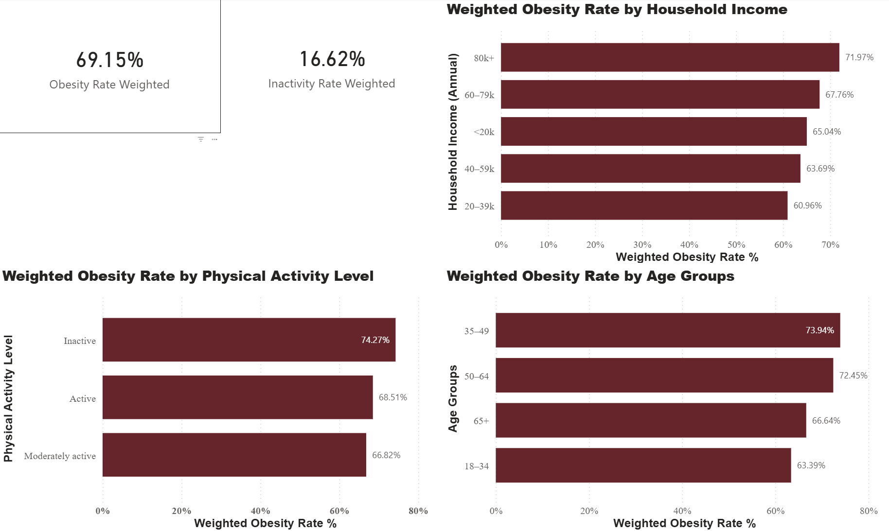
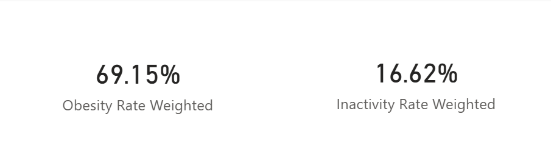
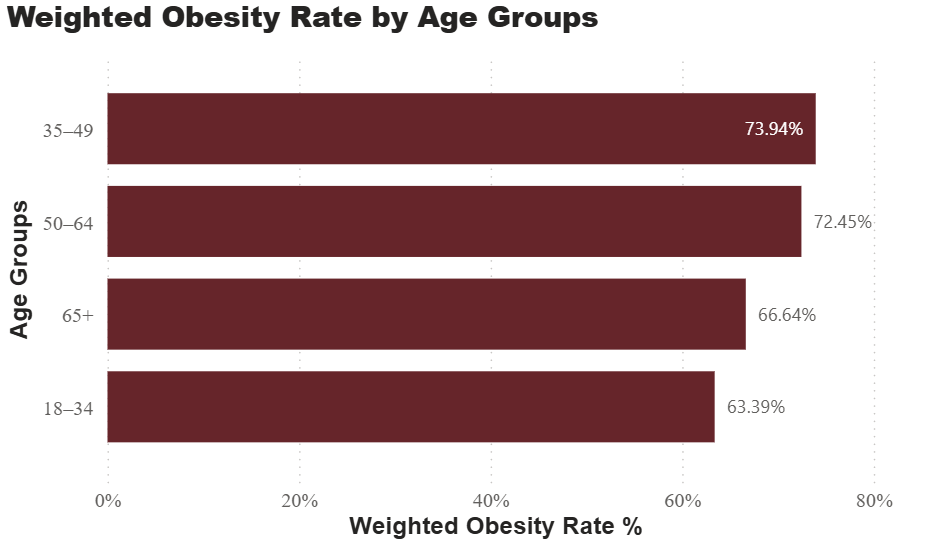

# Population Analytics Dashboard

## R Data Cleaning and Power BI Visualization Using CCHS 2022

### Dashboard Overview

### Full Dashboard Overview

### Key Population Health Indicators

### Obesity by Physical Activity Level

### Project Overview

This project demonstrates an end-to-end population health analytics workflow, combining data cleaning and transformation in R with interactive visualization in Power BI. The goal is to show how large-scale survey data can be converted into a decision-support dashboard that helps monitor obesity and physical inactivity across population segments.

The project is structured in two parts:

Analytical preparation in R, where raw survey data is cleaned, recoded, validated, and exported in a Power BI-ready format

Visual analytics in Power BI, where weighted indicators are displayed through KPI cards and comparative charts for decision-makers

Research Questions

Part 1 – Statistical Preparation (R)

&nbsp;	What factors are associated with obesity risk in the Canadian adult population?

Part 2 – Decision Support (Power BI)

&nbsp;	How can decision makers monitor obesity and physical inactivity trends across population segments to support data-driven interventions?

### 

### Project Structure

population-analytics-powerbi/

&nbsp;	CCHS 2022 PUMF Complement User Guide.pdf

&nbsp;	CCHS\_2022\_DataDictionary\_Freqs.pdf

 	pumf\_cchs.xlsx

 	STAT3530\_TermProject.R

 	Stats 3530 - Term Project Final Report.docx

 	PowerBi\_Export\_CCHS.R

&nbsp;	cchs\_powerbi\_respondent.xlsx

 	cchs\_powerbi\_segment\_kpis.xlsx

&nbsp;	Dashboard PowerBI.pbix

&nbsp;	PowerBI\_Dashboard\_Documentation.docx

&nbsp;	README.md

### Tools and Technologies

* **R** 

* **Power BI** 

* **Markdown / Word** 

### Data Source

The analysis is based on the Canadian Community Health Survey (CCHS) 2022 Public Use Microdata File (PUMF).

Key characteristics of the dataset:

* Nationally representative survey conducted by Statistics Canada

* Adult respondents aged 18+

* Includes health outcomes, behaviors, and socio-demographic variables

* Requires the use of survey weights for population-level inference

* Raw CCHS microdata is not included in this repository due to licensing and size considerations.

### Data Processing

All data preparation was performed in R, including:

* Filtering to adult respondents

* Recoding obesity status into a binary indicator

* Recoding physical activity into categorical levels

* Creating age group, income group, sex, and smoking status variables

* Handling missing and non-reported values

* Validating row counts and prevalence estimates

* Applying survey weights for population-representative analysis

* Exporting clean respondent-level and KPI-level CSV files for Power BI

* The exported CSVs serve as the single source of truth for the Power BI dashboard.

### Power BI Dashboard

The Power BI dashboard is designed to support monitoring and exploratory analysis, not causal inference.

#### Key Features

Weighted KPI cards showing:

* Obesity prevalence

* Physical inactivity prevalence

* Comparative bar charts showing weighted obesity rates by:

* Physical activity level

* Age group

* Annual household income

* Consistent formatting and labeling for non-technical audiences

* All metrics calculated dynamically using DAX measures

* Survey-weighted calculations ensure that all reported rates reflect the Canadian adult population rather than the raw survey sample.

### Dashboard Use Case

This dashboard can be used by analysts or policymakers to:

* Monitor overall obesity and inactivity prevalence

* Identify high-risk population segments

* Compare demographic and socioeconomic groups

* Support prioritization of targeted public health interventions

* Communicate population health trends clearly to stakeholders

### 

### Limitations

* Analysis is cross-sectional and does not imply causality

* Health measures are self-reported

* Income is reported in broad household categories

* Regional variation is not explored in this dashboard

* The dashboard is intended as a monitoring and decision-support tool, not a predictive or causal model.

### 

### Conclusion

This project demonstrates how population-level health survey data can be transformed into a practical decision-support tool through a combination of statistical data preparation and business intelligence visualization. By integrating R-based data cleaning with Power BI reporting, the project bridges the gap between analytical rigor and actionable insight.

The use of survey-weighted indicators ensures that all reported obesity and physical inactivity rates reflect the Canadian adult population rather than the raw survey sample. The resulting dashboard allows decision makers to identify high-risk groups, compare population segments, and explore behavioral, demographic, and socioeconomic patterns in a transparent and interpretable manner.

Beyond technical execution, the project emphasizes responsible data use and communication. Limitations related to self-reported measures, income categorization, and cross-sectional design are acknowledged, reinforcing that the dashboard is intended for monitoring and exploratory analysis rather than causal inference. Overall, this work illustrates how cleaned survey data, when paired with thoughtful visualization design, can support evidence-based public health planning and policy discussions.

